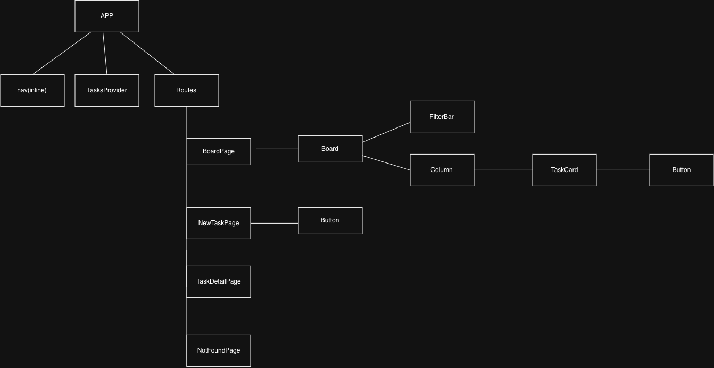
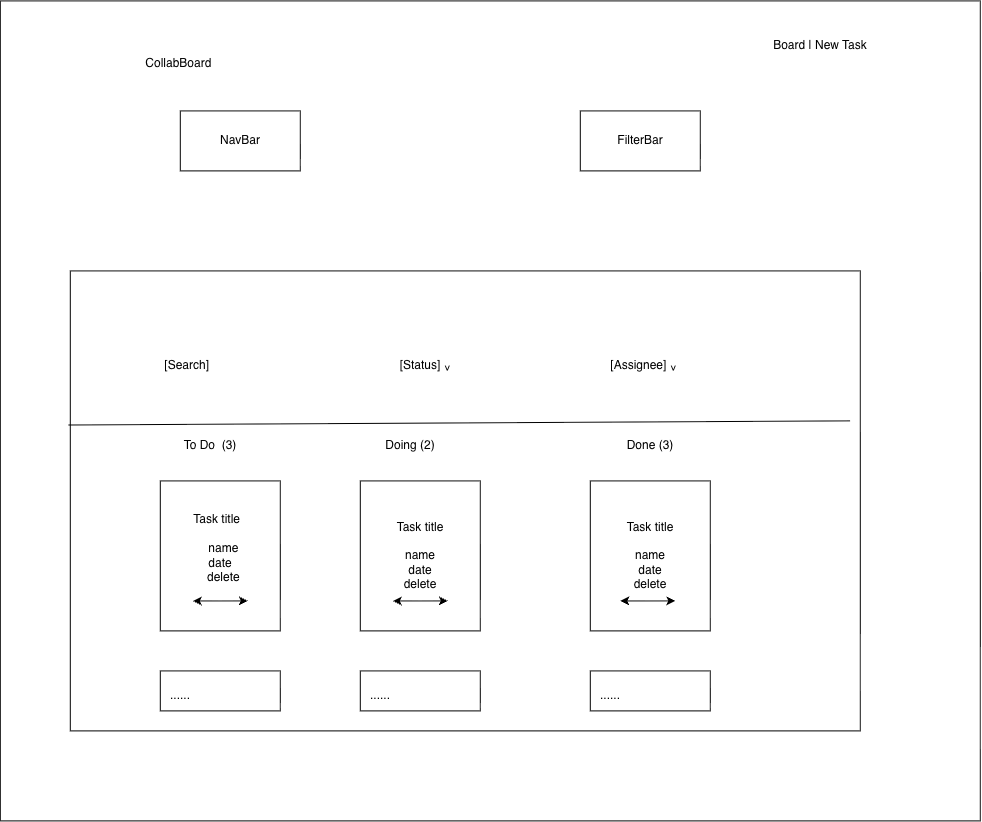

# 📋 CollabBoard - Client

The **React (Vite) frontend** for CollabBoard. For the project overview, full tech stack, team, and milestones, see the [root README](../README.md).

## 🚀 Getting Started

### Prerequisites

* **Node.js 18+**

### Installation & Dev Server

```bash
npm install
npm run dev        # http://localhost:5173
```

### 🧰 Other Scripts

```bash
npm run lint                  # Run ESLint
npm run build                 # Production build
npm run preview               # Preview the production build
npx prettier --write <files>  # Format specific files (not the whole repo)
```

## 📁 Project Structure

```text
src/
├── api/          # All network/API calls (mock for now) - nothing else calls fetch
├── components/   # Reusable UI (Board, Column, TaskCard, FilterBar, Button, Spinner)
├── pages/        # Route-level components (BoardPage, NewTaskPage, TaskDetailPage, NotFoundPage)
├── hooks/        # Shared stateful logic (useTasks)
├── context/      # Global task state (TasksProvider + useReducer)
├── utils/        # Pure utility functions (filterTasks)
└── data/         # mockTasks.js - stand-in database (removed once the API is live)
```

## 📐 Architecture & Data Flow

`TasksProvider` (Context + `useReducer`) is the **single source of truth** for tasks.

On mount it:

1. Calls `api/getTasks()` (with an artificial delay)
2. Shows a loading state
3. Dispatches a `loaded` action
4. Exposes `error` + `retry`
5. Provides task data to the rest of the app

Components read state through `useTasks()` and modify it with actions: `added`, `moved`, `deleted`.

### 🔌 API Layer

All network communication is isolated inside `api/`. Components **never call the API directly** - this keeps the frontend ready to swap mock data for the real Express REST API in M2 with no component changes.

## 🧭 Routing

| Route        | Purpose                               |
| ------------ | ------------------------------------- |
| `/`          | Main task board                       |
| `/tasks/new` | Create a new task                     |
| `/tasks/:id` | View task details (not-found handled) |
| `*`          | 404 / Not Found                       |

## ✨ Features (Assignment 1)

* **Board** - To Do / Doing / Done columns with per-column counts
* **Create Tasks** - controlled form with validation
* **Move & Delete** - move between columns; delete asks for confirmation
* **Task Details** - dedicated `/tasks/:id` route with graceful not-found state
* **Filter & Search** - by status/assignee + title search, reflected in the URL
* **Four UI States** - loading / error(+retry) / empty / success

## 📎 Design Documents

### Component Tree

* [draw.io file](./docs/component-tree.drawio)



### Wireframe

* [draw.io file](./docs/wireframe.drawio)


