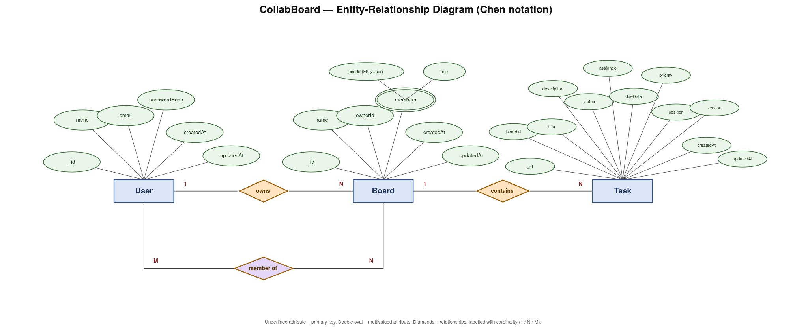

# CollabBoard — Data Model & Justification

## Collections

- **users**: Application users. Stores `name`, `email`, and a hashed password (`passwordHash`, stripped from all API responses).
- **boards**: Kanban boards. Stores `name`, `ownerId` (reference to the owning user), and an embedded `members` array (each with `userId` + `role`).
- **tasks**: Cards on a board. Stores `boardId` (reference to its board), `title`, `description`, `status`, `assignee`, `dueDate`, `priority`, `position`, `columnId`, and a `version` counter used for concurrency control.

## Embed vs Reference — and why

| Data | Choice | Why |
|---|---|---|
| Board `members` | **Embedded** in Board (`{userId, role}[]`) | Bounded — a board only ever has a handful of members. Members are always read together with the board (e.g. checking permissions), so embedding avoids an extra query. Membership also changes far less often than task data. |
| Task → Board relationship | **Referenced** (`boardId` on Task) | Tasks are unbounded — a board can accumulate hundreds of tasks over time, so embedding them inside the Board document would blow past MongoDB's 16MB document limit. Tasks are also volatile: read and written independently of the board, so a separate collection avoids rewriting the whole board on every task change. |
| Task `assignee` | **Free-text field**, not a reference | Stores a plain display name (defaults to `"Unassigned"`) rather than a `userId` reference — the client sends a name directly, so no join/lookup against `users` is needed to render a task. |
| Task `status` | **Enum field** on the Task document | `status` only ever takes a fixed set of values (`TASK_STATUSES`, e.g. `todo`/`doing`/`done`). A fixed, small set of values doesn't need its own collection — it's cheaper and simpler as a validated string field. |

## Indexes

- `boards.ownerId` — boards are looked up per-owner (e.g. "show me my boards"), so this field needs an index to avoid a full collection scan.
- `tasks.boardId` — every board view loads all of its tasks, making this the most frequent query pattern; this is the primary index on the Task collection.
- `users.email` — used on login/signup to check for existing accounts and to authenticate; should be indexed (and unique) since it's looked up on every login.

## Concurrency Strategy

Tasks use **optimistic concurrency control** via a manual `version` integer field on each Task document (distinct from Mongoose's built-in `__v`, which isn't incremented on ordinary field updates). On update, the request must include the version it read; the update only succeeds if the stored version still matches, and the version is then incremented. If the version doesn't match, the update is rejected — meaning someone else changed the task since it was last read — and the client must re-fetch and retry.

This was chosen over locking because task edits (dragging cards, changing status) are frequent but usually don't collide, and optimistic concurrency avoids blocking other users while one person's edit is in flight.

## ERD

**Done when:** a reader can see the model and the reasoning without reading code.
